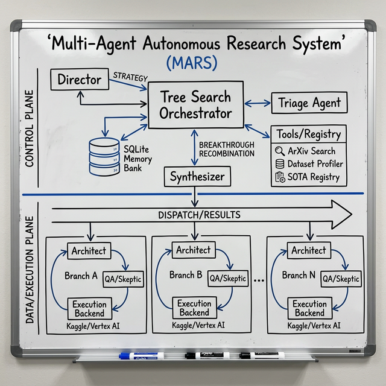
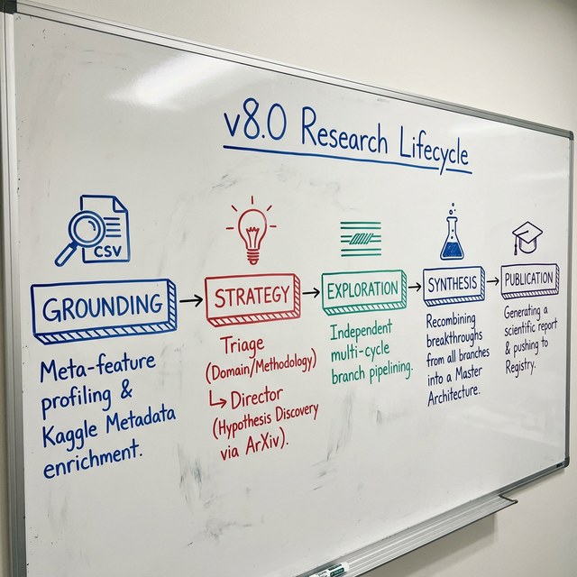
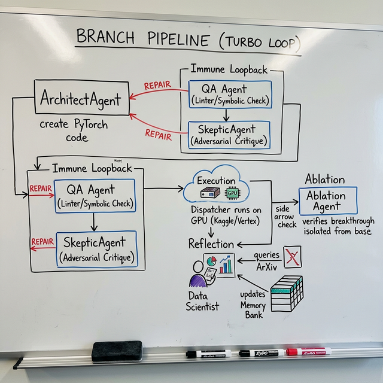

# 🧪 AutoResearch Lab: The Intelligent Frontier Engine (v8.0)

> **"Accelerating the Frontier: High-speed, self-healing, and stateful autonomous discovery."**

---

## 🚀 The Mission: Autonomous Scientific Discovery

**AutoResearch Lab** is a domain-agnostic, autonomous Multi-Agent System (MAS) designed to automate the entire lifecycle of artificial intelligence research. It moves beyond "AutoML" into **"Autonomous Science"**—where the system doesn't just tune hyperparameters, it discovers novel mathematical structures and solves complex data missions with minimal human intervention.

*Inspired by [karpathy/autoresearch](https://github.com/karpathy/autoresearch).*

---

## 🏗️ The "Intelligent Frontier" Architecture (v8.0)

Version 8.0 introduced the **"Turbo Engine,"** a significant leap in orchestration and self-healing.

### ⚡ Key Innovation Pillars:
1.  **Turbo Pipelining:** Independent research branches execute their entire lifecycle concurrently, maximizing hardware utilization and exploration breadth.
2.  **Adversarial Skeptic Loop:** A specialized `SkepticAgent` audits every proposed architecture for common ML pitfalls (overfitting, leakage, architectural mismatch) before a single GPU second is spent.
3.  **Immune Loopback:** A graph-based state machine allowing for high-speed local static analysis and AST-based verification. If errors occur, the **Architect** self-heals using distilled logs.
4.  **Triage & Domain Grounding:** Missions are automatically classified (Tabular/CV/NLP) and grounded in statistical meta-features (skewness, cardinality, sparsity).
5.  **Ablation Proofing:** The system automatically performs ablation studies to isolate the impact of every architectural innovation.

---

## 🧠 The Scientific Workflow

The engine operates on a **Discovery -> Pipelining -> Recombination** lifecycle:

### Phase 1: Strategic Discovery
The **Profiler** extracts meta-features, while the **Triage Agent** selects the optimal methodology (e.g., GBDT vs. Deep Learning). The **Director Agent** then proposes divergent, high-potential research hypotheses grounded in SOTA research.

### Phase 2: Independent Branch Pipelining (The "Turbo" Loop)
Each branch moves through its refinement cycles independently:

- **Architectural Generation:** Generates code (PyTorch/XGBoost) tailored to the hypothesis.
- **Verification Gates:** QA Agents perform AST-based verification and **Symbolic Shape Checking** using `FakeTensor`.
- **Remote Dispatch:** Validated code is pushed to remote GPU clusters (Kaggle/Vertex AI).
- **Log-Back Reflection:** Failures are distilled, analyzed, and fed back into the Architect for immediate repair.

### Phase 3: Breakthrough Recombination
The **Synthesizer Agent** merges breakthroughs from all branches—combining, for example, a feature engineering trick from Branch A with a training loop optimization from Branch B—into a new **Master Architecture**.

---

## 🔌 LLM Connectors & Frontier Model Support

The engine is built on a **Model-Agnostic Core**, optimized for the **March 2026** frontier landscape. We utilize high-reasoning flagship models for architectural design and high-throughput "Flash" models for rapid triage and log distillation.

| Provider | Frontier Reasoning (Architects) | High-Throughput (Agents/Triage) |
| :--- | :--- | :--- |
| **Google Vertex AI** | `gemini-3.1-pro`, `gemini-3.0-ultra` | `gemini-3.1-flash-lite`, `gemini-2.5-flash` |
| **OpenAI** | `gpt-5.4-thinking`, `o3-high-reasoning` | `gpt-5.4-mini`, `gpt-4o-agentic` |
| **Anthropic** | `claude-4.6-opus`, `claude-4-research` | `claude-4.6-sonnet`, `claude-3.7-sonnet` |
| **DeepSeek** | `deepseek-v4-r1`, `deepseek-v4` | `deepseek-v4-lite`, `deepseek-v3` |

---

## 🛡️ Institutional Integrity & Guardrails

The engine enforces "Scientific Rigor" through automated gates:
- **Symbolic Shape Check:** Uses `FakeTensorMode` to verify tensor compatibility before dispatching to expensive GPU instances.
- **Financial Telemetry:** Real-time cost tracking for every agent call, ensuring efficient use of research credits.
- **AST Validator:** Rejects any code that doesn't implement statistically rigorous evaluation (e.g., K-Fold CV).

---

## 🗺️ Roadmap: The Horizon of the Singularity Lab

- [x] **Horizon 2 (Current):** Independent Researcher. The system self-heals, self-directs, and conducts its own ablation studies.
- [ ] **Horizon 3 (Visionary):** Literature Review Agents. Integration of multi-modal research and autonomous paper analysis.
- [ ] **Horizon 4 (Self-Evolving):** Agents that modify their own `system_instructions` based on mission success rates.

---

## 🏆 Project Credits
- **Core Engine:** Built with Google Antigravity & Agent Development Kit.
- **Orchestration:** [LiteLLM](https://github.com/BerriAI/litellm) for robust model management.

  <strong>"The frontier is not a destination. It is a baseline we have yet to cross."</strong>

